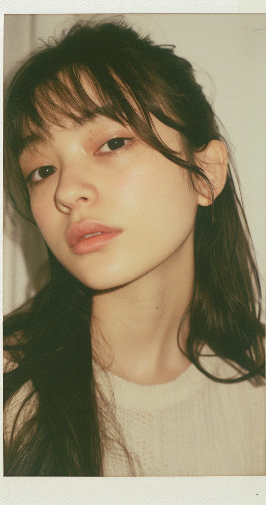
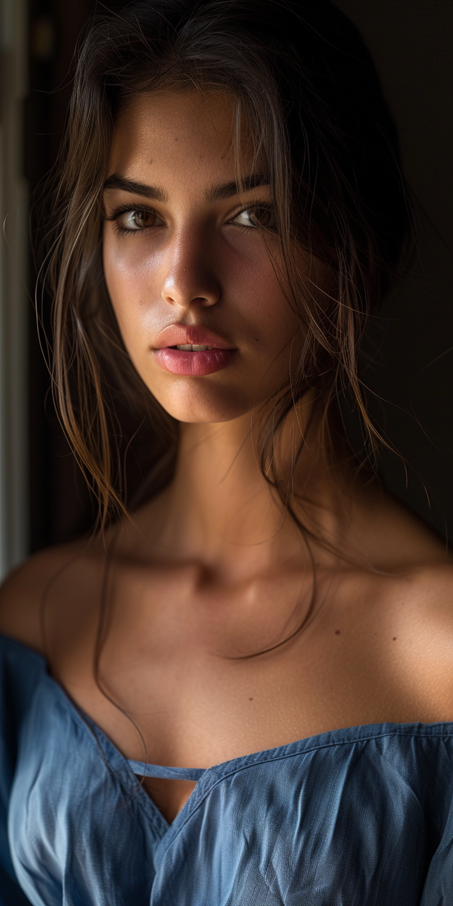
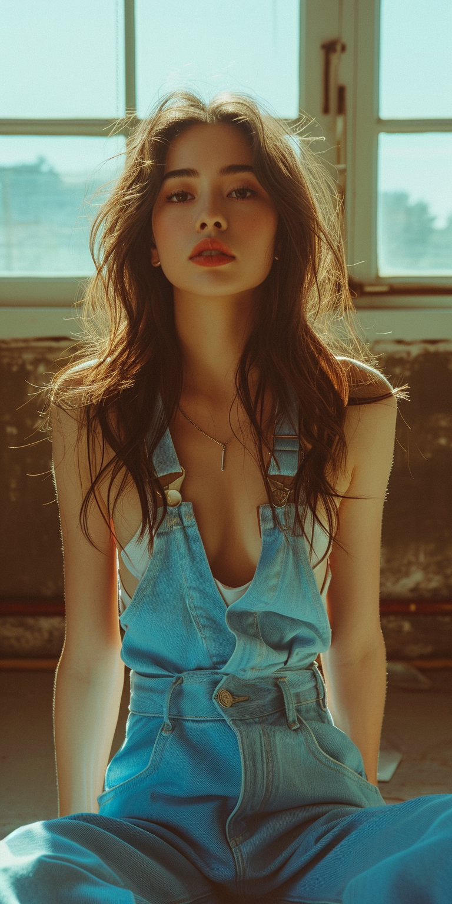
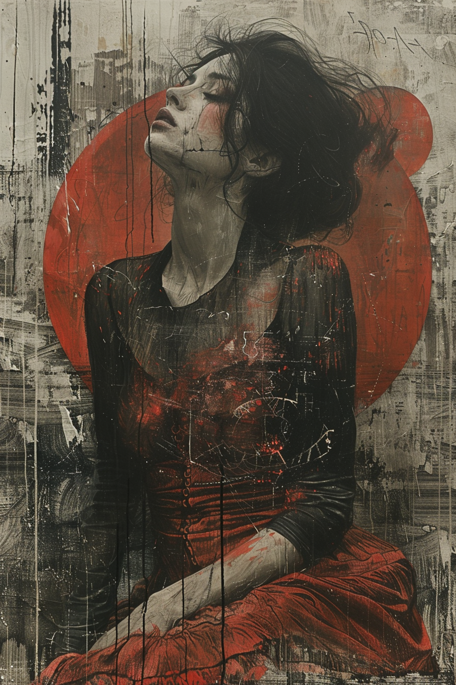

# 🎨 Midjourney Prompts

Curated Midjourney prompts for stunning AI-generated images.

---

## 📦 Available Prompts

## 📦 Available Prompts

<table>
  <tr>
    <td width="33%" align="center">
      
      <h4><a href="./fashion-photography/enchanting-indian-model-tradition-meets-modernity.md">Enchanting Indian Model</a></h4>
      
👁️ 1.68k | ❤️ 2

    </td>
    <td width="33%" align="center">
      
      <h4><a href="./fashion-photography/ultra-realistic-fashion-model-portrait.md">Ultra-Realistic Model</a></h4>
      
👁️ 17.3k | ❤️ 148

    </td>
    <td width="33%" align="center">
      
      <h4><a href="./portrait-photography/japanese-polaroid-portrait.md">Japanese Polaroid</a></h4>
      
👁️ 11.2k | ❤️ 128

    </td>
  </tr>
  <tr>
    <td width="33%" align="center">
      
      <h4><a href="./clipart/vibrant-boho-summer-girl-clipart-in-watercolor.md">Boho Summer Girl</a></h4>
      
👁️ 682 | ❤️ 8

    </td>
    <td width="33%" align="center">
      
      <h4><a href="./fashion-photography/spanish-supermodel-natural-light.md">Spanish Supermodel</a></h4>
      
👁️ 2.4k | ❤️ 29

    </td>
    <td width="33%" align="center">
      
      <h4><a href="./fashion-photography/minimalist-streetwear-fashion.md">Minimalist Streetwear</a></h4>
      
👁️ 1.5k | ❤️ 28

    </td>
  </tr>
  <tr>
    <td width="33%" align="center">
      
      <h4><a href="./fashion-photography/black-white-sony-a7iii.md">Black & White Portrait</a></h4>
      
👁️ 1.3k | ❤️ 28

    </td>
    <td width="33%" align="center">
      
      <h4><a href="./fashion-photography/blue-overalls-oshare-kei.md">Oshare Kei Style</a></h4>
      
👁️ 731 | ❤️ 28

    </td>
    <td width="33%" align="center">
      
      <h4><a href="./fashion-photography/movie-theater-portrait.md">Movie Theater Portrait</a></h4>
      
👁️ 1.7k | ❤️ 27

    </td>
  </tr>
  <tr>
    <td width="33%" align="center">
      
      <h4><a href="./concept-art/emotional-cyborg-girl.md">Emotional Cyborg Girl</a></h4>
      
👁️ 3.9k | ❤️ 43

    </td>
    <td colspan="2" align="center">
      
<strong>More prompts coming soon!</strong>

      
<small>Have a great prompt? <a href="../../CONTRIBUTING.md">Contribute →</a></small>

    </td>
  </tr>
</table>

---

## 🎯 Categories

- **Fashion Photography** (7 prompts) - Professional portraits, streetwear, natural lighting
- **Portrait Photography** (1 prompt) - Vintage Polaroid aesthetics
- **Concept Art** (1 prompt) - Surrealist expressionism, mixed media
- **Clipart & Illustrations** (1 prompt) - Watercolor, boho themes

---

## 🚀 How to Use

1. **Click on any image** above to view the full prompt
2. **Copy the prompt** from the markdown file
3. **Paste into Midjourney**
4. **Adjust parameters** as needed
5. **Generate** your stunning AI art!

---

## 💡 Want to Contribute?

Add your own Midjourney prompt! Read our [CONTRIBUTING.md](../../CONTRIBUTING.md) for guidelines.

**Remember**: Every prompt needs both the prompt text and preview image!
