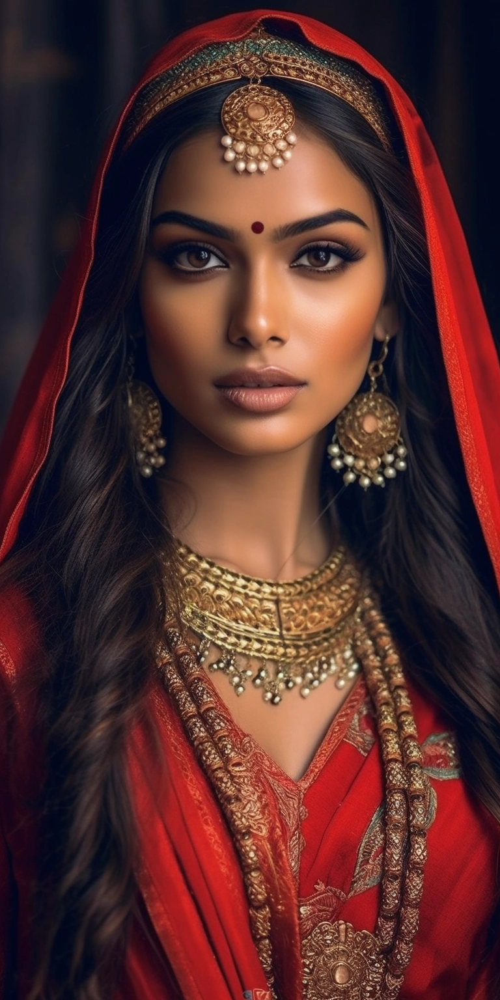
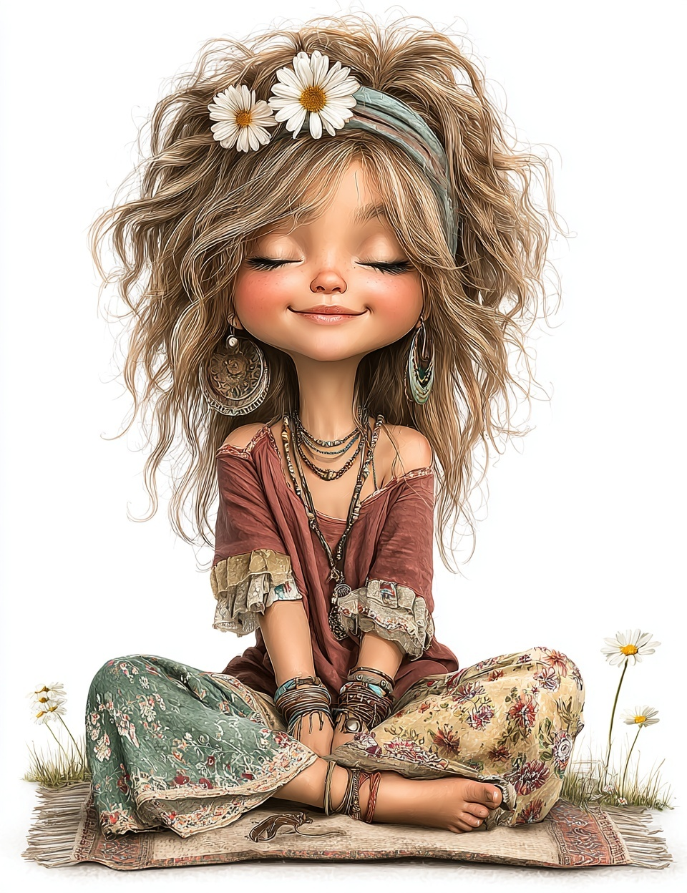

# 🎨 Midjourney Prompts

Curated Midjourney prompts for stunning AI-generated images.

---

## 📦 Available Prompts

<table>
  <tr>
    <td width="50%" align="center">
      <h3>Fashion Photography</h3>
      
      <h4><a href="./fashion-photography/enchanting-indian-model-tradition-meets-modernity.md">Enchanting Indian Model: Tradition Meets Modernity</a></h4>
      
<em>Traditional Indian fusion with modern aesthetics</em>

      
👁️ 1.68k views | ❤️ 2 likes

      
<code>Mesmerizing</code> <code>Style</code> <code>Fusion</code> <code>Tradition</code> <code>Modernity</code>

    </td>
    <td width="50%" align="center">
      <h3>Clipart & Illustrations</h3>
      
      <h4><a href="./clipart/vibrant-boho-summer-girl-clipart-in-watercolor.md">Vibrant Boho Summer Girl Clipart</a></h4>
      
<em>Watercolor clipart with hand-drawn outlines</em>

      
👁️ 682 views | ❤️ 8 likes

      
<code>Joy</code> <code>Summer</code> <code>Light</code> <code>Flowers</code> <code>Boho</code>

    </td>
  </tr>
</table>

---

## 🎯 Categories

- **Fashion Photography** - Traditional meets modern, cultural fusion
- **Clipart & Illustrations** - Watercolor, boho, summer themes

---

## 🚀 How to Use

1. **Click on any image** above to view the full prompt
2. **Copy the prompt** from the markdown file
3. **Paste into Midjourney**
4. **Adjust parameters** as needed
5. **Generate** your stunning AI art!

---

## 💡 Want to Contribute?

Add your own Midjourney prompt! Read our [CONTRIBUTING.md](../../CONTRIBUTING.md) for guidelines.

**Remember**: Every prompt needs both the prompt text and preview image!
