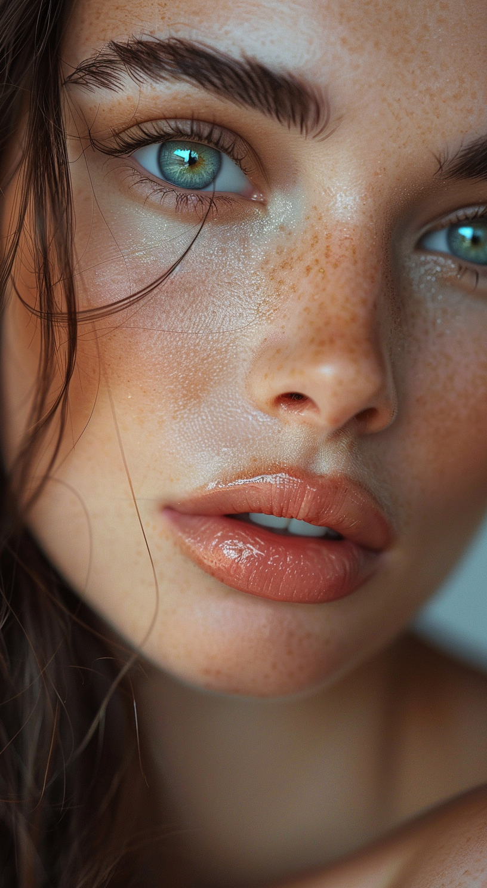

# Ultra-Realistic Fashion Model Portrait

## Description
Close-up portrait of a stunning fashion model with ultra-realistic details, professional photography quality shot on Sony A7III.

## Prompt

```
close-up of a stunning fashion model, ultra-realistic, portrait, shot on a Sony A7III, high quality --ar 35:64 --stylize 250
```

## Example Output



## Use Case
Perfect for creating:
- Professional fashion photography
- Ultra-realistic portrait photography
- High-end fashion editorials
- Magazine cover shots
- Beauty and cosmetics campaigns
- Professional model portfolios
- Commercial fashion photography
- Luxury brand imagery

## Style Elements
- **Photography Style**: Ultra-realistic portrait
- **Shot Type**: Close-up
- **Camera**: Sony A7III simulation
- **Quality**: High-end professional
- **Aspect Ratio**: 35:64 (vertical portrait)
- **Stylization**: 250 (high detail and refinement)

## Technical Parameters
- **--ar 35:64**: Vertical portrait aspect ratio, perfect for fashion shots
- **--stylize 250**: High stylization for enhanced artistic quality
- **Shot on Sony A7III**: Professional camera simulation for realistic depth and quality

## Photography Details
- **Focus**: Close-up portrait
- **Subject**: Fashion model
- **Realism**: Ultra-realistic rendering
- **Quality**: Professional high-end photography
- **Lighting**: Professional studio quality
- **Detail Level**: Extremely high

## Best For
- Fashion magazines
- Beauty campaigns
- Professional portfolios
- Commercial advertising
- High-end fashion brands
- Editorial photography
- Model headshots

## Platform
Midjourney 6

## Author
@NorthmoorAI

## Stats
- Views: 17.3k
- Favorites: 148

## Generation Parameters
- **Model**: Midjourney 6
- **Image Size**: 816x1488
- **Category**: Photography
